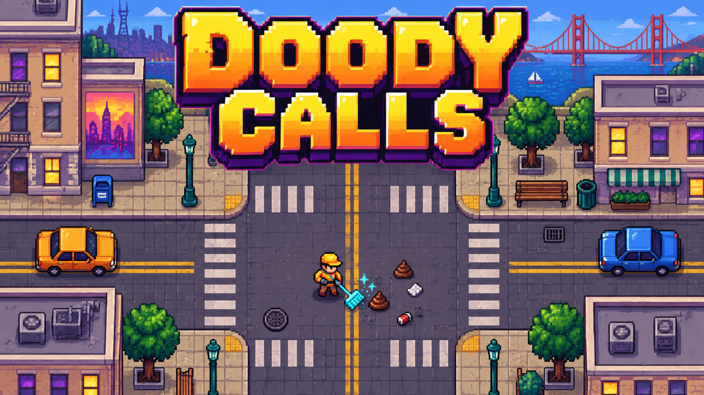

# Doody Calls

A top-down pixel-art cleanup arcade prototype by **King Made**. Race the clock to clear litter and sidewalk hazards across San Francisco districts.

[Play the browser prototype](https://kingmadellc.github.io/DoodyCalls/) · [King Made portfolio](https://kingmade.co/games/#doody-calls)

## Play

Open the browser prototype, choose Start, then select a worker. Move with the arrow keys or WASD; Space or Enter confirms menu selections, and Escape pauses. Touch gestures are supported on mobile.

This is an experimental prototype, with satirical characters and unfinished features. Progress and settings are saved locally in the browser. The cover is concept key art rather than a gameplay screenshot.

## Run locally

Serve this folder with a static HTTP server, then open its local address. No package installation or build step is required.

The public snapshot contains the browser game, its title graphic, and selected portfolio cover. The game logic is preserved from the existing prototype; public share URLs point to this repository's demo.
